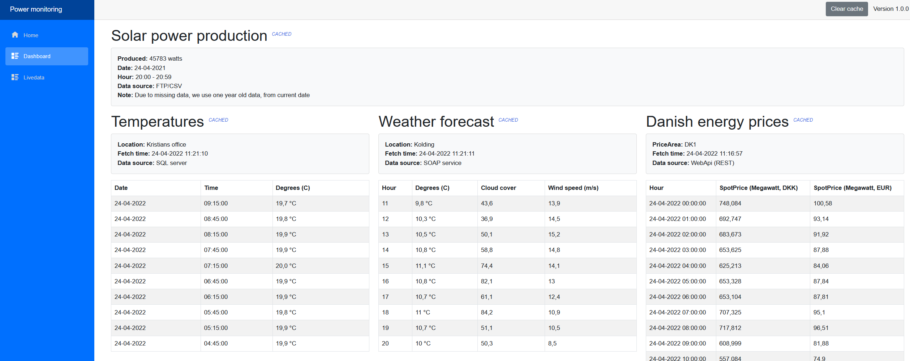

# Dashboard

 

## How to run

1. Ensure .Net 6.0 SDK is installed.
1. Open a command line
1. CD to /systemintegration/Dashboard/Client
2. Setup configuration
   - Create a copy of the file `appsettings.Sample.json`, ensure the name is precisely = `appsettings.Secrets.json`.
   - Fill out the secrets in file.
   - Also ensure Kafka IP address is correct in the setting `KafkaProvider.BootstrapServers` (this changes every time WSL/PC is rebooted).
5. Run this command: `dotnet watch run`. 
   - This should start a browser window with the blazor Dashboard application.
   - If it doesn't, try http://localhost:5000/dashboard/ instead

    

   Note: Launching directly from within Visual Studio will not work.

## How to setup Kafka using WSL2, so it's available for the Dashboard to use
Windows: Ensure ports are open for Kafka. 
  - Run the script in `devops/WslOpenPortsForKafkaService.ps1`
WSL: Ensure Docker daemon is running
  - Run: `sudo dockerd`
WSL: Ensure Kafka broker is running
  - Must have a docker-compose.yaml file present - see `devops/KafkaBroker/` -  and must have docker running.
  - Run: `sudo docker-compose up`

## Data sources
- Energidataservice.dk
  - https://www.energidataservice.dk/tso-electricity/elspotprices

## Flow of testing that the energy price flow works

1) Go to the Dashboard page. Initially the tile for energy prices on the right will now have no data - because nothing has been recieved yet and stored in the cache
2) Go to the Livedata page. Click `Process: Fetch energy prices, queue message, receieve and cache for use on dashboard`. This will set the following in motion.
  - When loading this view, a IncomingDanishEnergyPriceHandler is already listening for new messages. If it receieves one that is exactly the format it expects (i.e. `DanishEnergyPriceResponse`), it will cache this, so the system can now use it.
3) Go to the Dashboard page again. This time, energy prices will have data.
