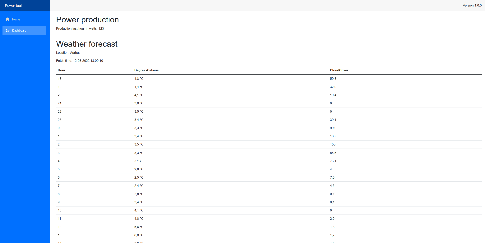

# systemintegrationcase

## Dashboard

### Screenshot

### How to run
- CD to /systemintegration/Dashboard/Case.Dashboard
- Open the /Properties/launchSettings.json, and add config values
- Run this command: `dotnet watch run`
- This should start a browser window with the blazor Dashboard application.
