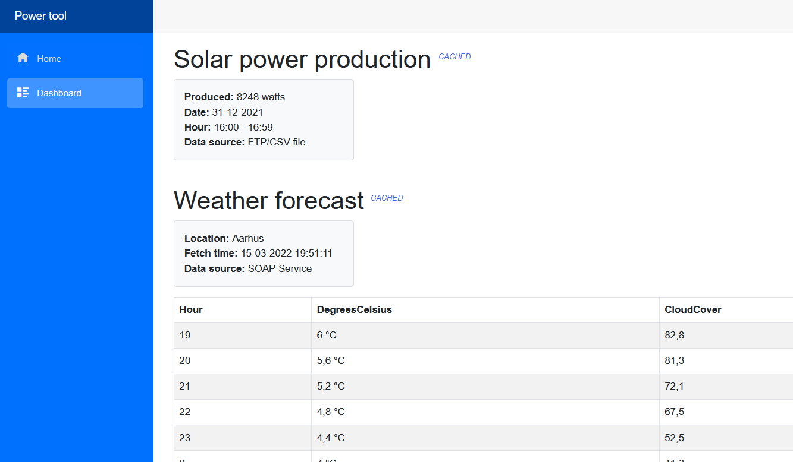

# systemintegrationcase

## Dashboard

### Screenshot

## How to run
- CD to /systemintegration/Dashboard/Case.Dashboard
- Follow `Setup configuration JSON file` section further down
- Run this command: `dotnet watch run`
- This should start a browser window with the blazor Dashboard application.

Note: Launching directly from within Visual Studio will not work.

 

## Setup configuration JSON file

1. CD to /systemintegration/Dashboard/Case.Dashboard
2. Setup configuration
   - Create a copy of the file `appsettings.Sample.json`, ensure the name is precisely = `appsettings.Secrets.json`.
   - Fill out the secrets in file.
5. Run this command: `dotnet watch run`. 
   - This should start a browser window with the blazor Dashboard application.